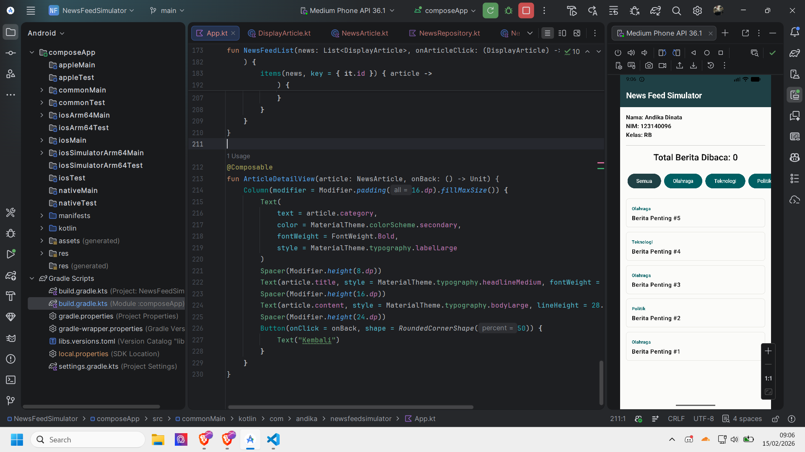
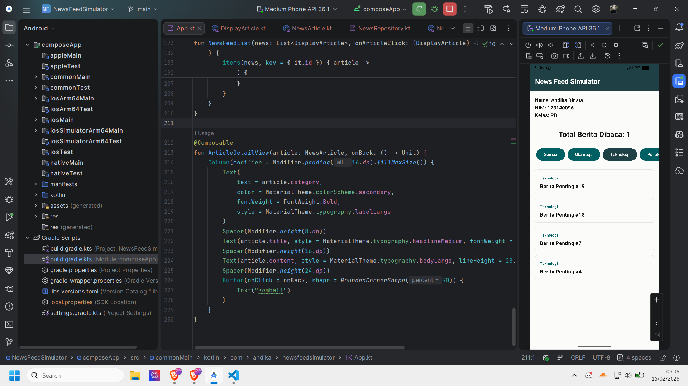
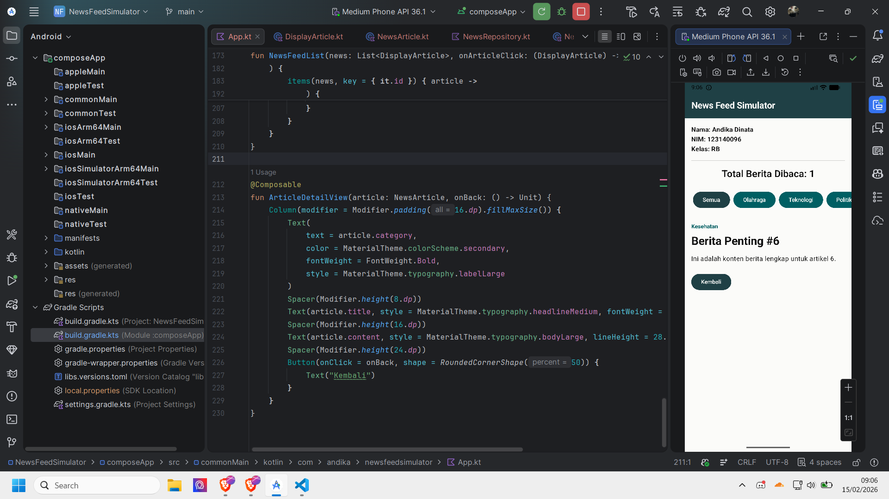
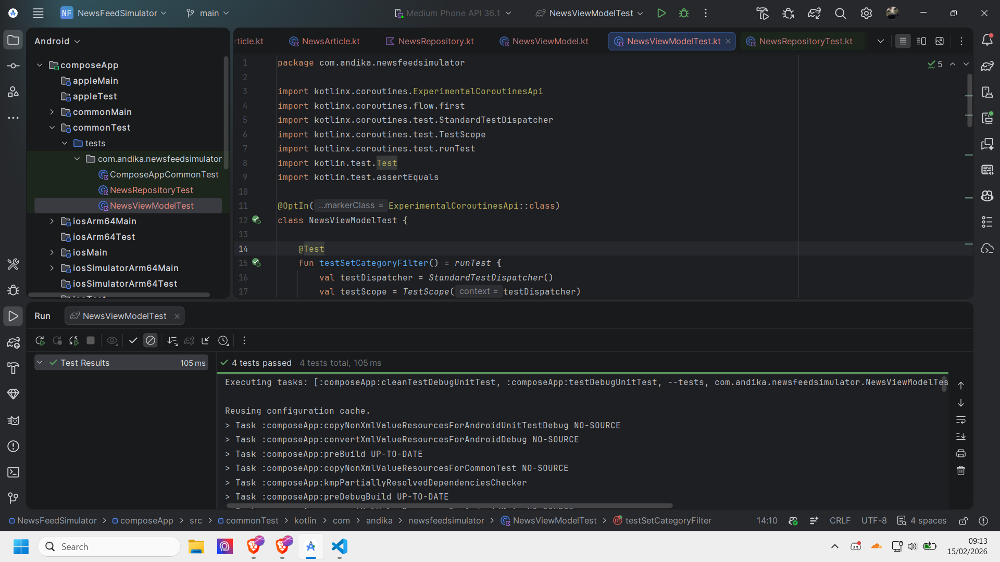
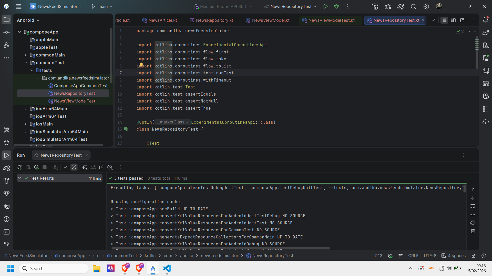

# Pengembangan Aplikasi Mobile (PAM) - Pertemuan 2

Tugas praktikum Pengembangan Aplikasi Mobile (PAM) - Pertemuan 2

**Nama:** Andika Dinata  
**NIM:** 123140096  
**Kelas:** RB

## Deskripsi

Aplikasi ini mensimulasikan feed berita yang update otomatis menggunakan Flow dan Coroutines. User bisa filter berita berdasarkan kategori dan melihat detail setiap berita. Aplikasi juga tracking berapa berita yang sudah dibaca.

## Fitur

1. **Auto-update Berita** - Berita baru muncul otomatis setiap 2 detik menggunakan Flow
2. **Filter Kategori** - Filter berita berdasarkan Olahraga, Teknologi, Politik, atau Kesehatan
3. **Tracking Baca** - Hitung otomatis jumlah berita yang sudah dibaca
4. **Detail Artikel** - Lihat konten lengkap berita dengan loading state
5. **Error Handling** - Handling error dengan `.catch()` operator dan try-catch

## Screenshots

### Homepage



### Filter kategori



### Halaman berita



### Unit Test




## Teknologi

- **Kotlin Multiplatform** - Shared codebase untuk Android/iOS
- **Compose Multiplatform** - Declarative UI
- **Coroutines & Flow** - Async programming dan reactive streams
- **StateFlow** - State management yang reactive
- **Material3** - Modern UI components

## Implementasi Requirements

### 1. Flow (25%)

- Flow builder untuk simulasi streaming data
- Emit berita baru setiap 2 detik
- Collect di ViewModel

### 2. Operators (20%)

- `filter` - Filter berita by kategori
- `map` - Transform NewsArticle → DisplayArticle
- `combine` - Combine multiple flows
- `sortedByDescending` - Sort by ID

### 3. StateFlow (20%)

- MutableStateFlow untuk internal state
- StateFlow untuk expose ke UI
- Reactive state updates

### 4. Coroutines (20%)

- Suspend function untuk async operations
- CoroutineScope.launch untuk background work
- Dispatchers untuk thread management
- Delay untuk simulasi network

### 5. Error Handling (Bonus +5%)

- `.catch()` operator di Flow
- Try-catch di suspend functions

### 6. Unit Testing (Bonus +5%)

- Test untuk ViewModel (filter, mark as read, fetch detail)
- Test untuk Repository (flow emissions, categories)

## Unit Test

Project ini dilengkapi dengan unit test untuk memastikan kualitas code:

**NewsViewModelTest.kt:**

- Test set category filter
- Test mark as read functionality
- Test duplicate prevention
- Test fetch article detail

**NewsRepositoryTest.kt:**

- Test flow emits articles
- Test valid categories
- Test multiple emissions

Untuk running test:

```bash
./gradlew test
```

## Cara Running

1. Clone/download project
2. Buka dengan Android Studio
3. Sync Gradle
4. Run di emulator atau device
