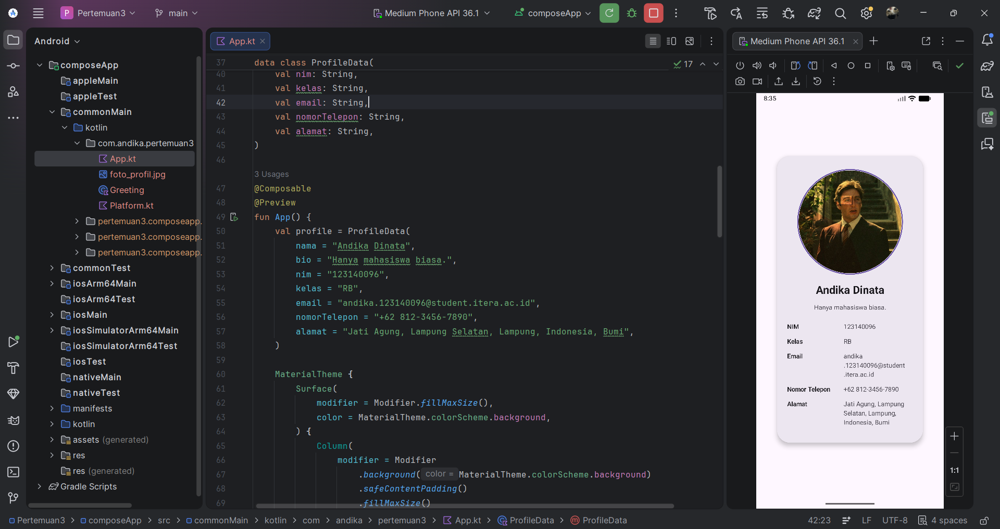

# My Profile App

Nama: Andika Dinata

NIM: 123140096

Kelas: RB

`My Profile App` adalah aplikasi sederhana untuk menampilkan data profil dalam bentuk card.

## Screenshot

## Fitur Utama

1. Halaman profil dengan header berisi foto profil berbentuk lingkaran.
2. Bio/deskripsi singkat.
3. Informasi profil:
   - Nama
   - NIM
   - Kelas
   - Email
   - Nomor telepon
   - Alamat

## Komponen UI yang Digunakan

Aplikasi ini menggunakan komponen berikut:

- `Column`
- `Row`
- `Box`
- `Card`
- `Text`
- `Image`
- `Icon`

## Reusable Composable

Minimal 3 composable reusable yang diimplementasikan:

1. `ProfileCard`
   - Container kartu utama dengan style dan padding.
2. `ProfileHeader`
   - Menampilkan foto profil circular dan nama.
3. `ProfileBody`
   - Menampilkan bio dan daftar informasi profil (NIM, Kelas, Email, Nomor telepon, Alamat).

## Cara Menjalankan Proyek

1. Buka proyek di **Android Studio**.
2. Tunggu proses Gradle Sync selesai.
3. Jalankan konfigurasi Android (emulator/perangkat fisik).
