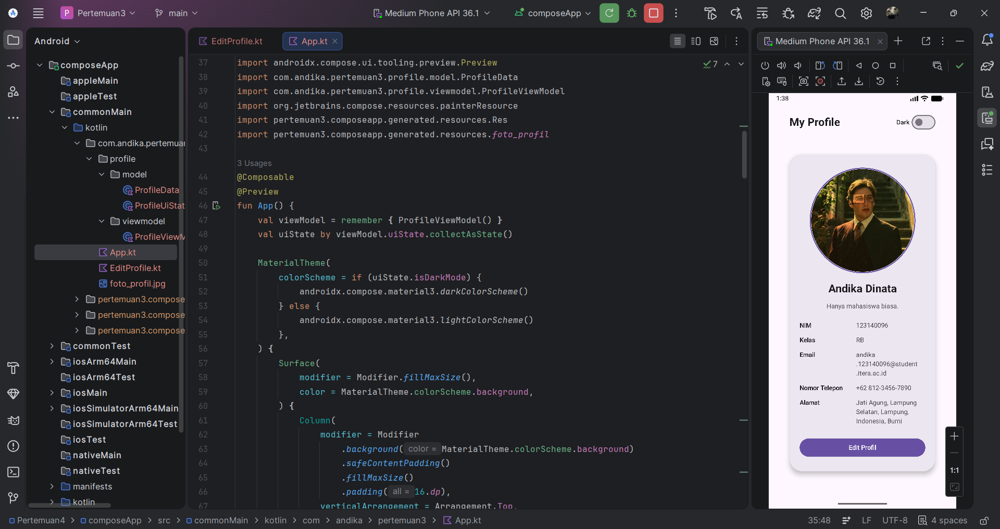
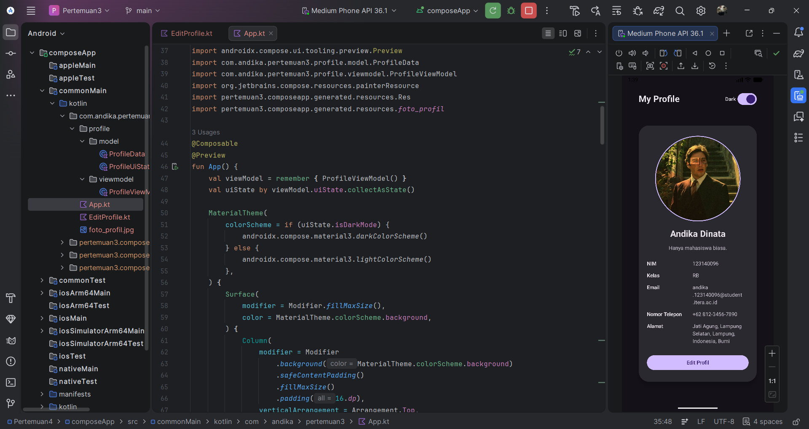
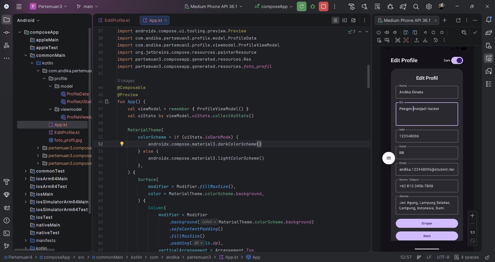
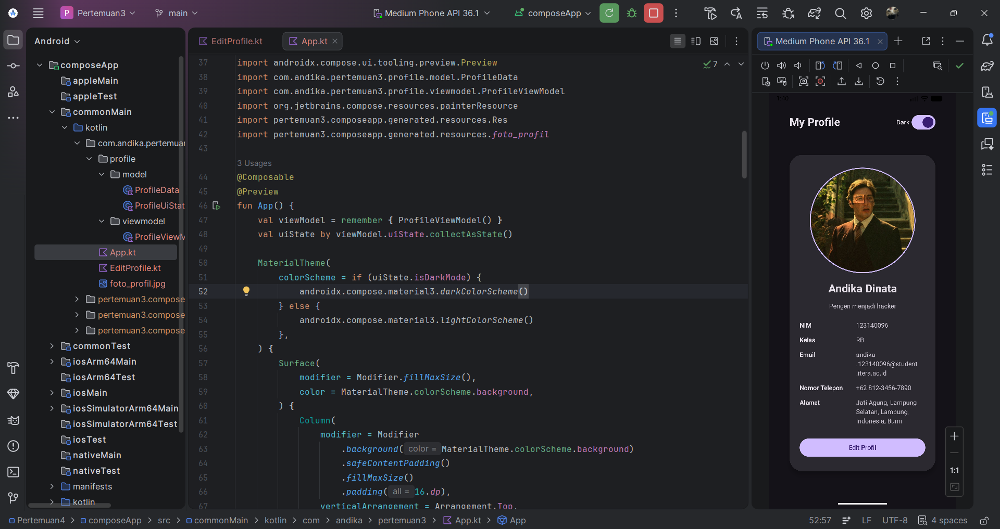

# My Profile App

Nama: Andika Dinata

NIM: 123140096

Kelas: RB

`My Profile App` adalah aplikasi profil sederhana berbasis Compose Multiplatform dengan arsitektur **MVVM**. Versi ini menambahkan fitur edit profil dan dark mode dengan state yang dikelola oleh `ViewModel`.

## Screenshot

Tampilan ketika light mode.

Tampilan ketika dark mode.

Mencoba mengedit bio menjadi "Pengen menjadi hacker"

Bio berhasil diperbarui.

## Fitur Utama

1. Tampilan profil dalam card dengan header foto profil berbentuk lingkaran.
2. Informasi profil:
   - Nama
   - NIM
   - Kelas
   - Email
   - Nomor telepon
   - Alamat
3. **Edit profile halaman terpisah**:
   - Form edit berada pada page terpisah dari halaman profil utama.
   - Semua field profil dapat diedit: Nama, Bio, NIM, Kelas, Email, Nomor Telepon, Alamat.
   - Tombol save untuk menyimpan perubahan ke `ProfileViewModel`.
4. **Dark mode toggle**:
   - Switch dark/light mode diletakkan di header (di luar card).
   - Nilai mode disimpan di `ProfileViewModel`.

## Implementasi MVVM

Implementasi mengikuti rubric tugas:

1. **ViewModel Implementation (25%)**
   - `ProfileViewModel` menggunakan `MutableStateFlow` dan mengekspose `StateFlow`.
2. **UI State Pattern (20%)**
   - `ProfileUiState` sebagai single source of truth untuk state UI.
3. **State Hoisting (20%)**
   - Komponen `ProfileInputField` bersifat stateless dan menerima `value` + `onValueChange`.
4. **Edit Feature (20%)**
   - Form edit halaman terpisah bekerja untuk semua field dan menyimpan perubahan ke state profil.
5. **Code Structure (15%)**
   - UI disederhanakan menjadi 2 file utama (`App.kt` dan `EditProfile.kt`)
   - Folder `profile` difokuskan untuk layer `model` dan `viewmodel`.

## Cara Menjalankan Proyek

1. Buka proyek di **Android Studio**.
2. Tunggu proses Gradle Sync selesai.
3. Jalankan konfigurasi Android (emulator/perangkat fisik).
