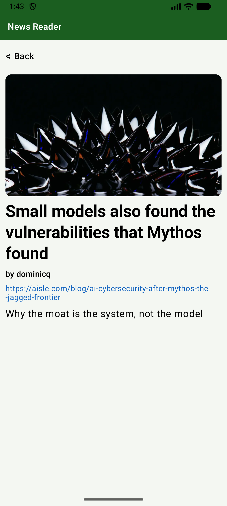
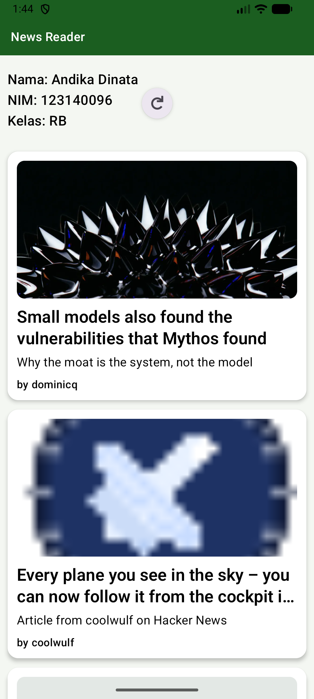

# News Reader

### Nama: Andika Dinata
### NIM: 123140096
### Kelas: RB

## Fitur Utama

- Menampilkan daftar berita teratas dari Hacker News.
- Menampilkan detail artikel saat item dipilih.
- Mendukung pull-to-refresh pada halaman daftar.
- Menampilkan state loading, success, dan error.
- Menampilkan placeholder jika gambar artikel tidak tersedia atau gagal dimuat.

## API yang Digunakan

Aplikasi menggunakan API publik Hacker News Firebase API:

- Top Stories ID:
  - `https://hacker-news.firebaseio.com/v0/topstories.json`
  - Mengembalikan daftar ID berita teratas.
- Detail Item (story/comment):
  - `https://hacker-news.firebaseio.com/v0/item/{id}.json`
  - Digunakan untuk mengambil detail berita berdasarkan ID.

Untuk memenuhi kebutuhan deskripsi dan gambar artikel:

- Aplikasi mengambil metadata dari halaman URL artikel (meta tag), khususnya:
  - `og:description` atau `description` untuk ringkasan.
  - `og:image` atau `twitter:image` untuk gambar.

Jika metadata gambar tidak tersedia, aplikasi menampilkan placeholder.

## Screenshots

### List artikel

### Detail Article

### Pull to refresh

### Video demo