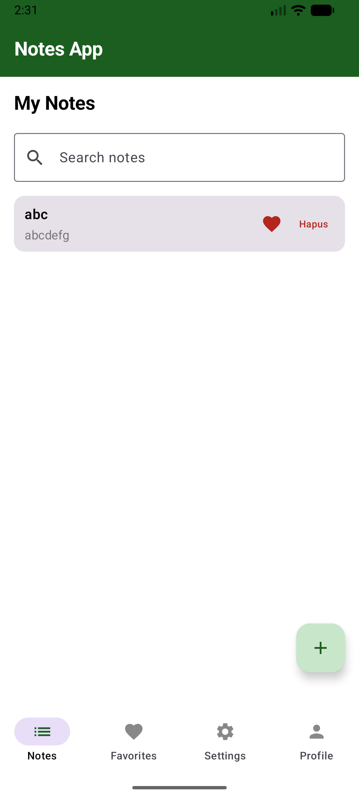
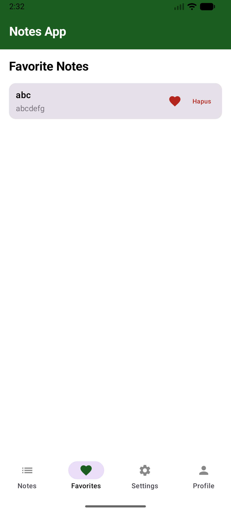
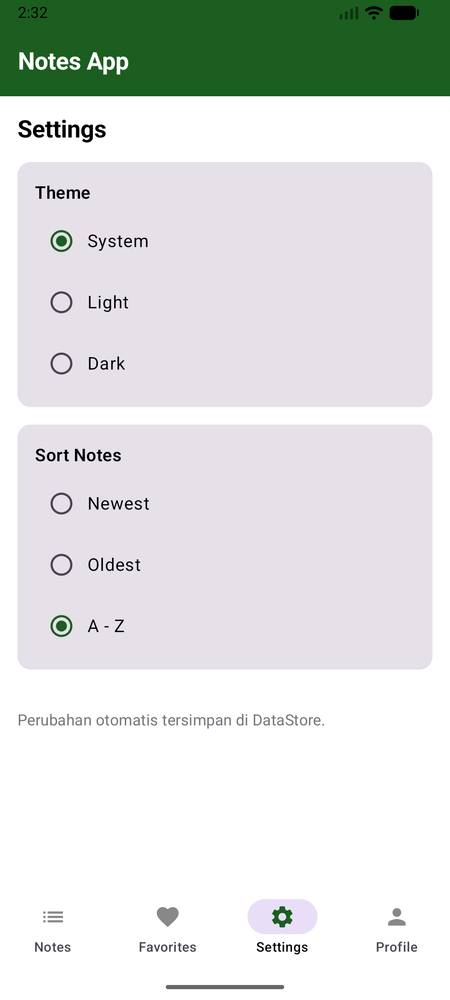
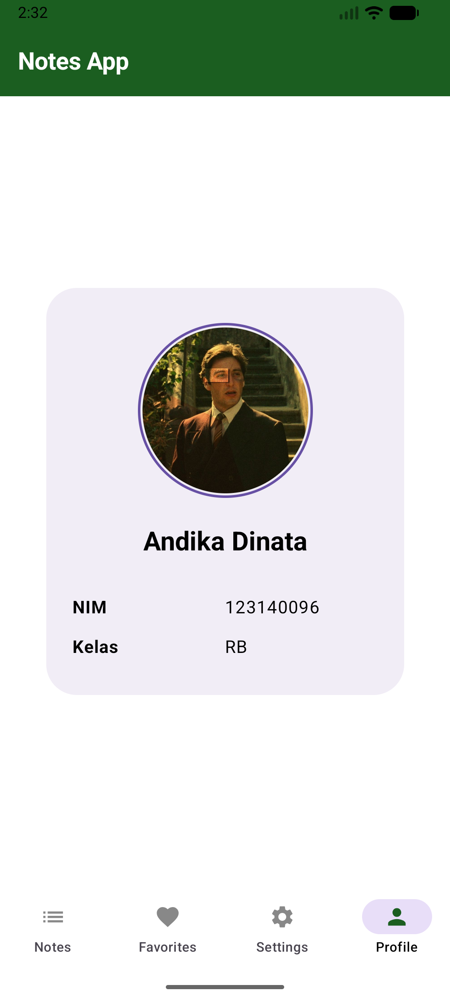
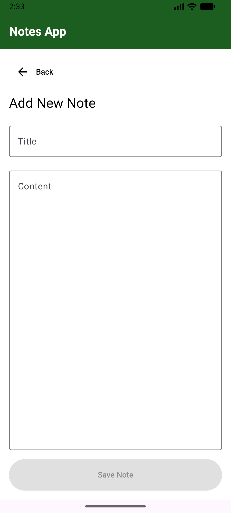
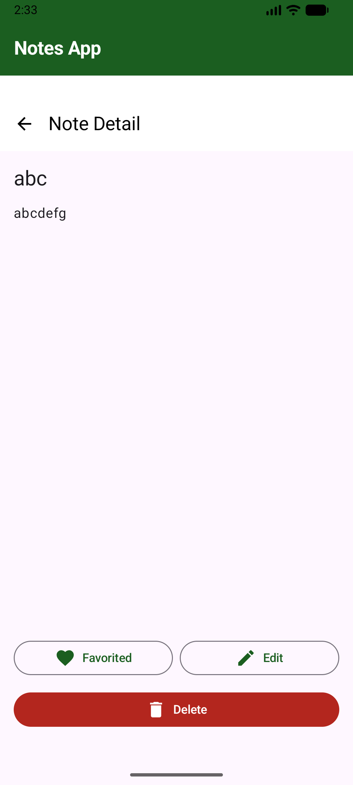
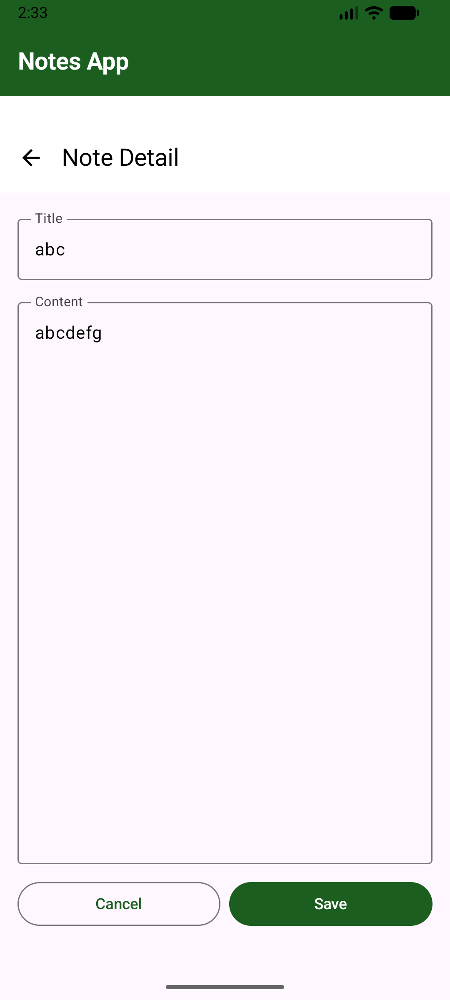

# Notes App

Nama: Andika Dinata

NIM: 123140096

Kelas: RB

## Video Dokumentasi

## Screenshots

## Fitur Implementasi Pertemuan 7

1. SQLDelight database untuk penyimpanan lokal notes.
2. CRUD lengkap: create, read, update, delete.
3. Search real-time berdasarkan title dan content.
4. Settings screen dengan DataStore Preferences KMP:
	 - Theme mode: System, Light, Dark.
	 - Sort order: Newest, Oldest, A-Z.
5. Offline-first: notes dan settings tetap tersimpan setelah app ditutup.
6. UI states: loading, empty, content, dan error snackbar.

## Arsitektur Singkat

- UI layer: Compose screens + Navigation.
- State layer: NotesViewModel dengan StateFlow.
- Data layer:
	- NotesRepository (SQLDelight)
	- SettingsRepository (DataStore Preferences)
- Platform wiring:
	- Android: AndroidSqliteDriver + PreferenceDataStoreFactory
	- iOS: NativeSqliteDriver + PreferenceDataStoreFactory
