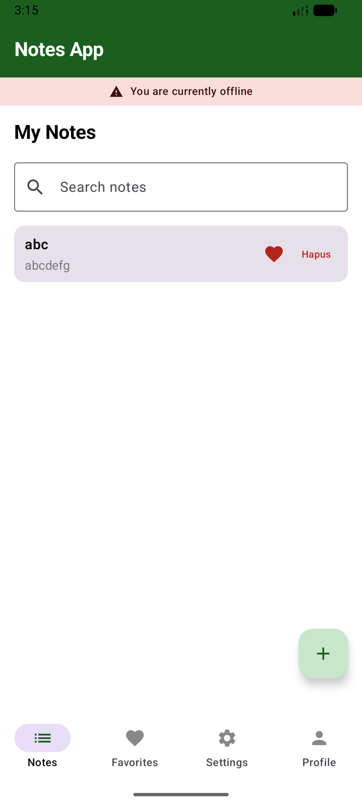
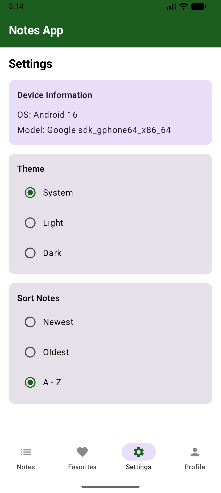

# Notes App

Nama: Andika Dinata

NIM: 123140096

Kelas: RB

## Video Dokumentasi

https://github.com/user-attachments/assets/62c045a2-e911-4be2-a8fb-26ced36fdaa6

## Screenshots

## Fitur Implementasi Pertemuan 7

1. SQLDelight database untuk penyimpanan lokal notes.
2. CRUD lengkap: create, read, update, delete.
3. Search real-time berdasarkan title dan content.
4. Settings screen dengan DataStore Preferences KMP:
    - Theme mode: System, Light, Dark.
    - Sort order: Newest, Oldest, A-Z.
5. Offline-first: notes dan settings tetap tersimpan setelah app ditutup.
6. UI states: loading, empty, content, dan error snackbar.

## Fitur Implementasi Pertemuan 8 (Platform Features & DI)

1. **Dependency Injection terpusat dengan Koin**: Menggantikan DI manual untuk manajemen *instance* yang lebih rapi di seluruh modul.
2. **Pola `expect/actual`** untuk mengakses API spesifik platform.
3. **Device Info Provider**: Membaca sistem operasi dan model perangkat keras yang digunakan, ditampilkan pada halaman Settings.
4. **Real-time Network Monitor**: Memantau status koneksi internet (menggunakan `ConnectivityManager` di Android dan `nw_path_monitor` di iOS) dengan peringatan *offline* UI dinamis di halaman utama.

## Arsitektur Singkat

- **UI layer**: Compose screens + Navigation.
- **State layer**: `NotesViewModel` dengan StateFlow.
- **Data layer**:
    - `NotesRepository` (SQLDelight)
    - `SettingsRepository` (DataStore Preferences)
- **Utility layer**: `DeviceInfoProvider` & `NetworkMonitor` (KMP `expect/actual`)
- **DI layer**: Koin (`commonModule` & `platformModule`)
- **Platform wiring**:
    - **Android**: `AndroidSqliteDriver`, `PreferenceDataStoreFactory`, Android `Context` injection, `ConnectivityManager`, `android.os.Build`.
    - **iOS**: `NativeSqliteDriver`, `PreferenceDataStoreFactory`, `nw_path_monitor`, `UIDevice`.
