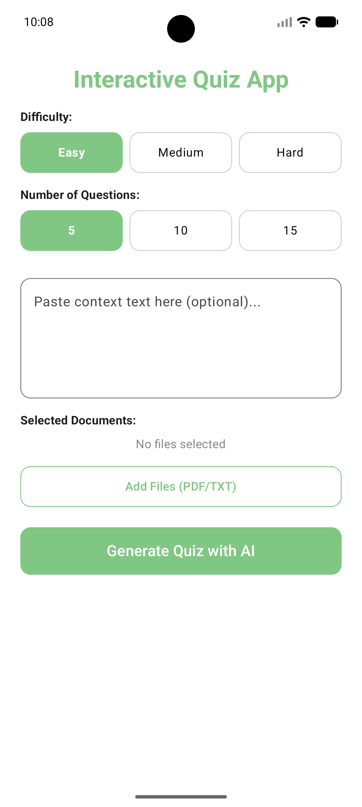
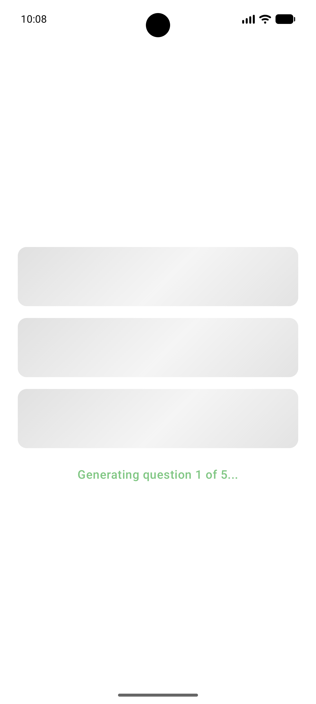
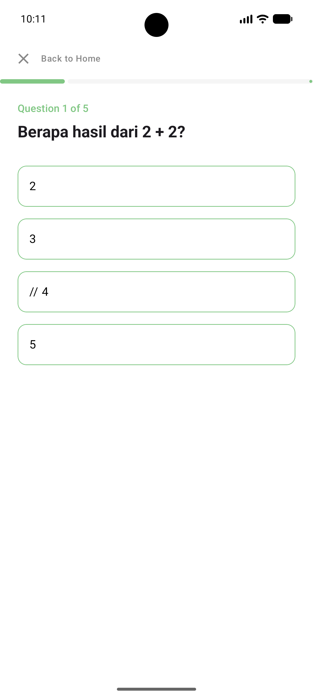

# Interactive Quiz App

Nama: Andika Dinata

NIM: 123140096

Kelas: RB

## Deskripsi Proyek
Interactive Quiz App adalah aplikasi mobile berbasis **Compose Multiplatform** yang memanfaatkan kecerdasan buatan (**Gemini AI**) untuk membuat kuis interaktif secara otomatis. Pengguna dapat memberikan konteks berupa teks manual maupun mengunggah dokumen (PDF/TXT), dan AI akan merancang pertanyaan pilihan ganda yang relevan beserta penjelasannya.

## Fitur Utama
- **AI-Powered Generation**: Menghasilkan judul dan pertanyaan kuis yang unik menggunakan Gemini AI melalui *Function Calling*.
- **Document Support**: Mendukung pembacaan konten dari file PDF dan TXT sebagai sumber materi kuis.
- **Customization**: Pengaturan tingkat kesulitan (Easy, Medium, Hard) dan jumlah pertanyaan (5, 10, 15).
- **Interactive Quiz Interface**: 
  - Progress bar untuk melacak status pengerjaan.
  - Feedback instan dengan penjelasan (*rationale*) untuk setiap jawaban.
  - Animasi transisi yang halus antar pertanyaan.
- **Modern UI/UX**: Menggunakan Material 3, efek *shimmer* saat pemuatan, dan desain yang responsif di Android & iOS.

## Fitur Implementasi Pertemuan 9
Pada pertemuan ini, fokus utama adalah integrasi layanan AI dan manajemen state yang kompleks:
1. **Gemini AI Integration**: Implementasi API Gemini menggunakan Ktor Client dengan teknik *Function Calling* untuk memastikan output data terstruktur (JSON).
2. **Advanced State Management**: Menggunakan `StateFlow` dan `ViewModel` untuk menangani berbagai *UI State* (Initial, Loading, Success, Error).
3. **File Handling**: Integrasi library `FileKit` untuk memilih dan membaca file dari perangkat secara *cross-platform*.
4. **Iterative Generation Strategy**: Teknik pembuatan soal satu per satu untuk menghindari *timeout* API dan meningkatkan kualitas soal yang dihasilkan.
5. **Animations & Shimmer**: Penggunaan `AnimatedContent` untuk transisi soal dan `InfiniteTransition` untuk efek pemuatan (*shimmer loading*).

## Prompt Engineering (Gemini AI)
Aplikasi ini menggunakan teknik *Prompt Engineering* yang spesifik untuk memastikan output dari AI akurat dan terstruktur:

### 1. Title Generation Prompt
Digunakan untuk menghasilkan judul kuis yang menarik berdasarkan konteks yang diberikan.
```text
Generate a catchy title for a quiz based on the provided context.
```

### 2. Question Generation Prompt
Digunakan untuk menghasilkan soal pilihan ganda satu per satu. Prompt ini sangat detail untuk menjamin kualitas dan validitas data:
```text
Generate question #[index] of [total] for a multiple-choice quiz.
Language: Indonesian.
Difficulty: [difficulty]

REQUIREMENTS:
1. Provide EXACTLY 4 options.
2. The 'correctAnswer' MUST be one of the strings inside the 'options' array.
3. Ensure the 'correctAnswer' matches the chosen option character-for-character.
4. Focus on accuracy and relevance to the provided documents.
[exclusionText - to avoid duplicate questions]
```

## Screenshots
<p align="center">
  
  
  
</p>

## Video Dokumentasi
[Link Video Dokumentasi - Jika ada]

## Teknologi yang Digunakan
- **Framework**: Compose Multiplatform (Android & iOS)
- **Language**: Kotlin
- **Networking**: Ktor Client
- **AI**: Google Gemini API
- **Serialization**: Kotlinx Serialization
- **File Picker**: FileKit
- **Dependency Injection**: Manual / ViewModel Factory
